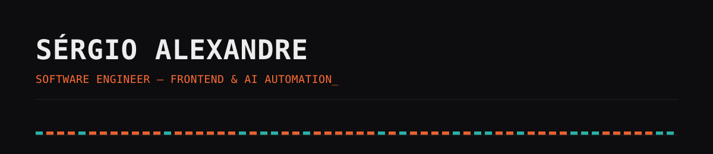

  

  Frontend engineer building AI-orchestrated automation — n8n flows that run the product 
  end-to-end, with WhatsApp as one of the interfaces, not the point.

 

Comecei a estudar tecnologia em 2015 e entrei na faculdade (UTFPR) em 2021, no meio da
pandemia — vi o mercado mudar duas vezes diante dos meus olhos: primeiro a
supervalorização dos devs, depois a virada pra IA. Isso me deu base técnica suficiente
pra navegar, questionar e entender contexto rápido, em vez de só seguir receita. Testo
rápido, prototipo em paralelo com IA, e acredito que hoje um bom dev com acesso a IA
trabalha como um time inteiro.

 

### Agora

Construindo automação orientada por IA na **Aeon Audio** (plataforma de comunidade pra
DJs/produtores) e na **Kaizen** (automação de portaria/condomínio) — fluxos n8n que
orquestram o produto de ponta a ponta.

 

### Stack

   
   
  

  
  
  

 

### Projetos

<!-- TODO: confirmar slugs/links exatos dos repositórios antes de publicar -->

- **[Como-Eles-Votaram](https://github.com/Serg-Ale/Como-Eles-Votaram)** — plataforma de
  transparência política: mostra como deputados/senadores votam de fato vs. o que
  prometem, com sincronização automática via n8n direto das APIs da Câmara e do Senado.
- **[SAERIX-PORTFOLIO](https://github.com/Serg-Ale/SAERIX-PORTFOLIO)** — portfólio
  pessoal em Next.js 16 / React 19, animações GSAP scroll-triggered, estética
  brutalista, glitch effects, cursor magnético.
- **[MatrixRan](https://github.com/Serg-Ale/matrix-rain)** — variações visuais de
  frontend geradas com IA, explorando composição e movimento.

 

### Fora do código

Produtor musical e DJ (**LXNDR**) — a mesma lógica de padrão, ritmo e iteração que uso
em código também aparece nas faixas. [Ouça no SoundCloud](https://soundcloud.com/lxndr_serg).

 

  
  

 

  <a href="https://www.linkedin.com/in/serg-alexandre/">LinkedIn</a> ·
  <a href="https://github.com/Serg-Ale">GitHub</a>
  <!-- TODO: adicionar link do portfólio ao vivo quando estiver no ar -->

